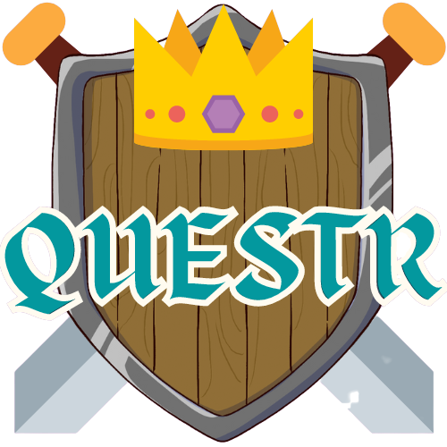
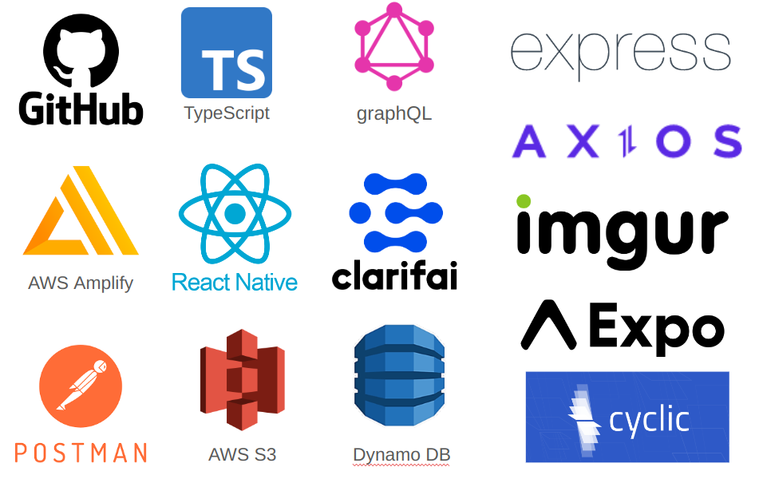

# Questr

Questr is the prototype app created by our team, Artificial Responsibility, as the final project of our [Northcoders](https://northcoders.com/) 13-week long bootcamp.

### Initial Idea

An orienteering app that incentivises getting out and about exploring your local vicinity in the form of accepting and completing quests. The quests would be a variety of problem-solving riddles, puzzles, minigames involving AR and location based tasks that would accrue rewards as both coins and XP.

<br />

### User stories:
 - User can sign up and make a profile
 - User will upon opening the app to see a map showing the quests available in their local area
 - User can select a quest which will require them to go to a certain location and carry out a task to complete the quest
 - User's location is verified upon arrival
 - User will be able to select their avatar
 - User can view their quest history
 - User can view current profile stats visualised as radar chart

### Quest details:
 - use of location verification <br/><I>All tasks require the user to go to a particular location and check in</I>
 - use of image recognition <br/><I>e.g. Quest objective is to take a picture of the horse at your location. Upon submission of picture, our image recognition will verify if the task is completed</I>
 - solving riddles <br/><I>e.g. Quest objective is to answer 'How many cannons are at this dock?'. Submission will be verified to accept a range of correct answers, e.g. 2 or Two or two</I>
 - battle a computer opponent <br/><I>Based loosely on rock-paper-scissors logic, your attack and opponent's defence combination result in whether your attack lands or not. The stats that you accrue in the game through completing quests, allow you to battle with higher level opponents and earn more rewards.</I>

### Technologies used:

- [React-native](https://reactnative.dev/docs/getting-started)
- [Expo](https://expo.dev/)


- [TypeScript](https://www.typescriptlang.org/)
- [AWS DynamoDB](https://aws.amazon.com/dynamodb/)
- [graphQL](https://graphql.org/)
- [clarifai](https://www.clarifai.com/)
- [AWS Amplify](https://aws.amazon.com/amplify/)
- [AWS Cognito](https://aws.amazon.com/cognito/)
- [Express](https://aws.amazon.com/cognito/)
- [Axios](https://axios-http.com/)
- [imgur](https://apidocs.imgur.com/)
- [cyclic](https://www.cyclic.sh/)
- [postman](https://www.postman.com/)
- [(AWS S3)](https://aws.amazon.com/s3/)

## How to run a local copy
### 1. Install dependencies
<I> Due to a newly released Authenticator not being available in react-native, we suggest you install the dependencies in the following order:</I>
```
$ npm i aws-amplify-react-native@6.0.8
$ npm i aws-amplify@4.3.43
$ npm i --peer-legacy-deps
```

### 2. Add your imgur client Id
<I>The project relies on hosting our images on imgur. You will need to have an account with them and create your client id by following the instructions [here](https://apidocs.imgur.com/)</I>
```
$ cd native-app/utils
$ echo "export const clientId: string = 'Client-ID YOUR-CLIENT-ID-HERE'" > imgurClientId.tsx
```

### 3. Configure your [AWS](https://aws.amazon.com/) account
```
$ amplify configure
```

### 4. Run using Expo
<I>Install the Expo Go app onto your mobile or use an android emulator</I>
<br />
Then type the following into the folder containing the app.
```
$ npm start
```
and scan the barcode to bundle the app and enjoy!

## Artificial Responsibility
Our team, Artificial Responsibility, was made up of
[Aaron Currie](https://www.linkedin.com/in/aaron-currie/), 
[Alexander Smith](https://www.linkedin.com/in/alexander-smith-403509216/), 
[Jonathan Barker](https://www.linkedin.com/in/jonny-barker-b8663a207/), 
[Qamar Usman](https://www.linkedin.com/in/qamar-usman56/) and
[Rebecca Flynn](https://www.linkedin.com/in/rebeccaflynn314159/).


## Acknowledgements
Many thanks to the support, encouragement and outstanding tuition of the [Northcoders](https://northcoders.com/) Team, without which, this project would not have been possible.
